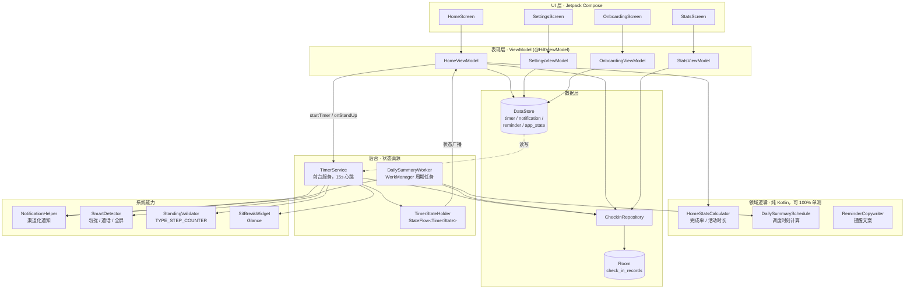

# 站一站 · 久坐健康提醒助手

[](https://github.com/jiangbei0921/Inactivity-alert-app-/actions/workflows/android-build.yml)
[](https://www.android.com/)
-blue.svg)
-blue.svg)
[](LICENSE)

> 一款专为久坐人群设计的 Android 健康提醒应用：在专注工作时，定时温柔地提醒你起身活动，帮你把「站起来」变成习惯。

**站一站** 通过前台计时服务持续监测久坐时长，到点推送提醒；你可选择「我站起来了」记录打卡，或「推迟 5 分钟」稍后再提醒。所有数据**仅保存在你的设备上**，应用不联网、不上传、不含任何统计/广告/崩溃上报 SDK。

---

## 📑 目录

- [项目简介](#项目简介)
- [功能特性](#功能特性)
- [安装步骤](#安装步骤)
- [使用说明](#使用说明)
- [技术栈](#技术栈)
- [架构设计](#架构设计)
- [目录结构](#目录结构)
- [工作原理](#工作原理)
- [测试与质量保障](#测试与质量保障)
- [🔒 安全与隐私](#-安全与隐私)
- [贡献指南](#贡献指南)
- [许可证](#许可证)
- [联系与反馈](#联系与反馈)
- [🌐 产品官网](#产品官网)

---

## 🌐 产品官网

想要更直观地了解「站一站」并下载体验？请访问产品官网：

🔗 **[https://c6ec35d2328a41cab277d33bfa690546.bj9.agentos-app.net](https://c6ec35d2328a41cab277d33bfa690546.bj9.agentos-app.net)**

官网为纯静态页面，支持 **中文 / English** 一键切换，可直接下载最新 APK。

---

## 项目简介

「站一站」面向长期伏案办公、学习的人群，用最低的打扰成本帮助你对抗久坐带来的健康风险。它不依赖服务器、不收集个人信息，核心逻辑全部在本地运行：

- **轻量提醒**：圆环计时一目了然，到点以通知形式轻提醒，不打断心流。
- **本地数据**：站立次数、完成率、活跃时长等数据保存在本机 Room 数据库与 DataStore，绝不外传。
- **智能免打扰**：可配置工作时间、提醒日期；当处于通话、勿扰或全屏应用（如看视频/演示）时自动延后提醒，避免尴尬。
- **跨日统计**：近 7 天、按周、按年的站立数据看板，帮助你看见自己的进步。

---

## 功能特性

### 主页 · 久坐计时
- 点击「开始计时」启动久坐监测，圆环进度条实时显示已坐时长。
- 到达提醒间隔后推送通知，可选择「我站起来了」记录打卡，或「推迟 5 分钟」。
- 今日记录卡片展示当日站立次数、完成率、活跃时长，可展开查看全部打卡时间线
- 打卡可被步数传感器**被动验证**是否真起身，统计更可信（需在系统设置中授予「活动识别」权限，未授予则照常记录）。

### 统计 · 数据看板
- 近 7 天每日站立次数柱状图，与每日目标对比。
- 周均完成率、总打卡次数、最长连续达标天数。
- 年度统计：每月站立次数、年度完成率、最佳月份。

### 设置 · 个性化配置
- **久坐提醒间隔**：10 ~ 90 分钟预设或自定义（1 ~ 180 分钟）。
- **微休息间隔**：5 ~ 30 分钟预设或自定义，可开关。
- **工作时间段**：滑动选择起止时间，非工作时间自动暂停计时。
- **提醒日期**：周一至周日多选，支持「工作日 / 每天 / 清空」快捷选项。
- **提醒声音 / 振动**：多套系统铃声可选并支持试听。
- **全屏应用免打扰**（可选）：授予「使用情况访问」权限后，可设置在全屏应用（视频、游戏、演示）前台时自动延后提醒。

### 帮助 · 使用指南
- 5 步上手教程、适用人群、久坐危害科普，以及意见反馈入口（邮件）。

### 桌面小组件
- 提供 Glance 实现的 App Widget，桌面即可查看当日站立进展。

---

## 安装步骤

### 方式一：下载 CI 自动构建的 APK（推荐体验）

不想本地编译，可直接下载由 GitHub Actions 在每次推送 `main` 后自动构建的最新安装包：

- **最新版 APK（持续更新）**：[app-debug.apk](https://github.com/jiangbei0921/Inactivity-alert-app-/releases/download/latest/app-debug.apk)

> 该链接指向仓库 `latest` 发布中的 `app-debug.apk`，基于发布标签，长期稳定可用（不受预发布标识影响）。每次向 `main` 推送代码，CI 都会重新构建并把最新 APK 更新到该发布。

**安装步骤**
1. 在手机浏览器中打开上面的链接，下载 `app-debug.apk`。
2. 若系统提示「禁止安装未知来源应用」，按提示允许本次安装（设置 → 安全 / 应用安装 → 允许来自此来源）。
3. 打开下载完成的 APK，按界面提示完成安装。
4. 首次启动后进入「设置」配置提醒间隔与工作时段，返回主页点击「开始计时」即可使用。

> ⚠️ **关于该安装包**：当前发布的是 **Debug 签名**的 `assembleDebug` 产物，用于体验与测试。Debug 包使用公开的 Android 调试密钥签名、未启用代码混淆，安全-sensitive 场景下不建议长期使用（详见[安全与隐私](#-安全与隐私)）。正式发布请确保使用自有签名密钥的 Release 构建。

### 方式二：从源码构建

**环境要求**
- Android Studio Hedgehog (2023.1.1) 或更高
- JDK 17（Android Studio 内置 JBR 亦可）
- Android SDK（compileSdk / targetSdk = 34，即 Android 14）
- Gradle 8.5（仓库已含 `gradlew` / `gradlew.bat` 与 `gradle-wrapper.jar`）

**克隆与构建**
```bash
git clone https://github.com/jiangbei0921/Inactivity-alert-app-.git
cd Inactivity-alert-app-

# 设置 JAVA_HOME（Windows 示例，使用 Android Studio 内置 JBR）
$env:JAVA_HOME = "C:\Program Files\Android\Android Studio\jbr"

# 编译并安装到已连接设备
./gradlew installDebug

# 或使用根目录一键脚本
powershell -ExecutionPolicy Bypass -File .\run.ps1
```

> 说明：早期版本曾缺失 `gradlew` 且仅能通过 CI 构建；仓库现已恢复 `gradlew` 与包装文件，本地构建与 CI 行为一致。

---

## 使用说明

1. **首次配置**：进入「设置」设定久坐提醒间隔、微休息间隔、工作时间段与提醒日期；选择提醒声音与是否振动。
2. **开始计时**：主页点击「开始计时」，App 以后台前台服务持续计时；计时圆环实时反映已坐时长。
3. **响应提醒**：
   - 点「我站起来了」→ 记录一次站立打卡并重置计时。
   - 点「推迟 5 分钟」→ 5 分钟后再提醒。
4. **智能免打扰**（可选）：在系统「设置 → 安全 → 使用情况访问」中授予本应用权限后，观看视频、游戏、演示等全屏应用前台运行时，提醒会自动延后，避免打扰。未授予该权限时，此能力自动降级关闭，不影响其他功能。
5. **查看统计**：「统计」页查看近 7 天、周、年维度的站立数据与达标情况。
6. **后台稳定提醒**：为保证提醒稳定送达，请在系统设置中允许「站一站」的**通知权限**与**自启动 / 忽略电池优化（后台运行）**。

**必要权限一览**

| 权限 | 类型 | 用途 |
|------|------|------|
| `POST_NOTIFICATIONS` | 运行时（Android 13+） | 推送久坐提醒通知 |
| `FOREGROUND_SERVICE` | 普通 | 后台计时前台服务 |
| `FOREGROUND_SERVICE_SPECIAL_USE` | 普通 | 声明久坐计时为「特殊用途」前台服务 |
| `USE_FULL_SCREEN_INTENT` | 普通 | 在合适时机以全屏方式呈现提醒 |
| `RECEIVE_BOOT_COMPLETED` | 普通 | 开机后自动恢复活跃会话的计时 |
| `VIBRATE` | 普通 | 提醒振动 |
| `PACKAGE_USAGE_STATS` | **特殊权限（需手动授权）** | 检测全屏前台应用以智能延后提醒（可选、可降级） |
| `ACTIVITY_RECOGNITION` | **运行时（Android 10+）** | 被动步数检测，验证「是否真站立」（可选、可降级，未授予不影响核心功能） |

> 应用**不申请**任何网络、定位、通讯录、麦克风、相机、短信、电话状态等敏感权限。
> 另声明 `ACTIVITY_RECOGNITION`（Android 10+ 运行时权限，可选）：仅用于本地被动验证站立，不联网、不上传；未授予时所有功能正常。

---

## 技术栈

| 类别 | 技术 | 版本 |
|------|------|------|
| 语言 | Kotlin | 1.9.22 |
| UI 框架 | Jetpack Compose + Material 3 | BOM 2024.02.00 |
| 架构 | MVVM（ViewModel + StateFlow） | — |
| 依赖注入 | Hilt / Dagger | 2.50 |
| 数据库 | Room | 2.6.1 |
| 键值存储 | DataStore Preferences | 1.0.0 |
| 导航 | Navigation Compose | 2.7.7 |
| 后台服务 | Foreground Service | — |
| 后台任务 | WorkManager（每日小结） | 2.9.0 |
| 通知 | NotificationCompat（渠道化） | — |
| 小组件 | Glance AppWidget | 1.0.0 |
| 权限封装 | Accompanist Permissions | 0.34.0 |
| 单元测试 | JUnit4 + MockK + Turbine + coroutines-test | 4.13.2 / 1.13.9 / 1.0.0 |
| 国际化 | `values`（zh）+ `values-en`（en） | — |
| 构建 | Android Gradle Plugin + Gradle | AGP 8.2.2 / Gradle 8.5 |
| 最低 / 目标 | Android API | minSdk 26 / targetSdk 34 |

---

## 架构设计

分层遵循单向数据流：**UI 只读状态、只发事件；状态的唯一真源在 Service 与 DataStore/Room**。



关键设计取舍（更多细节见 [`docs/ARCHITECTURE_DECISIONS.md`](docs/ARCHITECTURE_DECISIONS.md)）：

| 决策 | 选择 | 核心理由 |
|------|------|----------|
| 计时状态放哪 | 前台 Service + `TimerStateHolder` | Activity 可能被回收，ViewModel 不能作为跨进程存活的真源 |
| 依赖注入 | Hilt（`@HiltViewModel` / `@AndroidEntryPoint`） | 消除 `AndroidViewModel` 里手搓单例，ViewModel 可脱离 Context 构造从而可测 |
| 后台小结 | WorkManager 而非 AlarmManager | 可延迟任务，交给系统合并唤醒；重启后调度自动保留 |
| 站立验证 | 本机 `TYPE_STEP_COUNTER` 阈值判定 | 不联网、不引入模型，权限缺失时安全降级为「不可用」 |
| 统计口径 | 抽成 `HomeStatsCalculator` 纯函数 | 除零 / 负值 / 截断这些边界能用 JVM 单测锁死 |

---

## 目录结构

```
com.sitbreak.app
├── SitBreakApplication.kt           # Hilt 入口 + 注册每日小结周期任务
├── MainActivity.kt                  # 应用入口 Activity（@AndroidEntryPoint）
├── TimerState.kt                    # 计时状态定义 + TimerStateHolder
├── di/
│   └── AppModule.kt                 # Hilt 单例：DataStore / Repository / Validator
├── data/
│   ├── CheckInRepository.kt         # 打卡数据仓库（业务逻辑入口）
│   ├── SettingsDataStore.kt         # 设置门面（聚合多个 DataStore）
│   ├── AppStateDataStore.kt         # 应用级一次性状态（首启引导标记）
│   ├── NotificationSettingsDataStore.kt
│   ├── ReminderSettingsDataStore.kt # 含全屏应用黑名单（智能免打扰）
│   ├── TimerSettingsDataStore.kt
│   └── db/
│       ├── AppDatabase.kt           # Room 数据库
│       ├── CheckInDao.kt            # 打卡记录 DAO
│       └── CheckInRecord.kt         # 打卡记录实体
├── detector/
│   └── SmartDetector.kt             # 智能免打扰判断（勿扰/通话/全屏应用）
├── navigation/
│   └── NavGraph.kt                  # 导航图 + 底部导航
├── notification/
│   ├── NotificationHelper.kt        # 通知构建与发送（含全屏 Intent）
│   ├── NotificationActionReceiver.kt# 通知栏快捷操作接收器
│   └── ReminderCopywriter.kt        # 提醒文案
├── receiver/
│   └── BootReceiver.kt              # 开机自启（仅活跃会话恢复）
├── service/
│   ├── TimerService.kt              # 前台服务：后台计时核心
│   └── TimeUtils.kt                 # 本地时区/工作时段工具
├── health/
│   └── StandingValidator.kt         # 步数传感器被动验证「是否真站起来」
├── ui/
│   ├── activity/                    # 活动/健康中心详情页
│   ├── components/                  # 通用 UI 组件
│   ├── help/                        # 帮助与反馈
│   ├── home/                        # 主页（计时 + ViewModel + HomeStatsCalculator）
│   ├── onboarding/                  # 首启引导（三页 + 完成标记落盘）
│   ├── reminder/                    # 全屏提醒 Activity
│   ├── settings/                    # 设置页
│   ├── splash/                      # 启动页
│   ├── stats/                       # 统计页
│   └── theme/                       # 主题与配色
├── work/
│   ├── DailySummaryWorker.kt        # 每日小结 CoroutineWorker
│   └── DailySummarySchedule.kt      # 调度时刻计算（纯 Kotlin，可单测）
└── widget/
    └── SitBreakWidget.kt            # 桌面小组件（Glance）

app/src/main/res/
├── values/strings.xml               # 中文（默认）
└── values-en/strings.xml            # 英文
```

---

## 工作原理

```
用户点击「开始计时」
    → HomeViewModel.startTimer()
        → DataStore 写入 sittingStartTime
        → 启动 TimerService（前台服务，specialUse 类型）
    → TimerService 周期性检查（约每 15s）
        → 是否在工作时间段 + 启用日期
        → 是否达到提醒间隔
        → SmartDetector 判断：勿扰 / 通话 / 全屏应用 → 延后
        → 满足条件则通过 NotificationHelper 推送通知
    → 用户点击「我站起来了」
        → 重置计时 + 写入 Room 数据库（记录一次站立）
    → 用户退出 App
        → onTaskRemoved 清除计时状态（下次需重新计时）
```

---

## 测试与质量保障

```bash
./gradlew testDebugUnitTest   # 单元测试（CI 门禁，失败即阻断）
./gradlew lintDebug           # Android Lint
./gradlew assembleDebug       # Debug 包
./gradlew assembleRelease     # Release 包（R8 混淆 + 资源压缩）
```

**单元测试覆盖的模块**

| 测试类 | 覆盖点 |
|--------|--------|
| `HomeStatsCalculatorTest` | 完成率/活动时长的除零、负值、上限截断、目标不可计算 |
| `DailySummaryScheduleTest` | 每日小结触发时刻的跨天与边界，保证延迟非负 |
| `TimerStateHolderTest` | 计时状态机的 Flow 发射序列与去重（Turbine） |
| `StandingValidatorTest` | 无传感器/无权限时的安全降级（MockK） |
| `NotificationHelperTest` | 通知渠道 / ID / Action 常量唯一性 |
| `SettingsDataStoreTest`、`ReminderCopywriterTest` | 设置默认值与文案池 |

**CI 流水线**（`.github/workflows/android-build.yml`，推送 `main` 与所有 PR 触发）

1. `actions/cache` 缓存 Gradle 依赖与 wrapper
2. `testDebugUnitTest` —— **测试不通过直接失败，不产出包**
3. `lintDebug` —— 静态检查（`continue-on-error`，只做提示不阻断）
4. `assembleDebug` —— 构建产物
5. 仅 `main` 分支：把 APK 发布到 `latest` release

**Release 构建**已启用 `isMinifyEnabled` + `isShrinkResources`；签名信息从环境变量（`SIGNING_KEYSTORE` 等）读取，**不落库**，未配置时自动跳过签名配置以保证任何人 clone 后都能直接构建。

---

## 🔒 安全与隐私

本节基于**当前代码与配置的实际状态**编写，目的在于透明披露数据处理方式与已知风险，便于用户与贡献者做出审慎判断。

### 安全模型（现状）

| 维度 | 现状 | 说明 |
|------|------|------|
| 网络访问 | **无任何网络权限** | `AndroidManifest.xml` 未声明 `INTERNET` / `ACCESS_NETWORK_STATE` 等，应用无法发起任何网络请求。 |
| 第三方 SDK | **不含统计 / 广告 / 崩溃上报** | 依赖仅来自 Google Maven 与 Google Accompanist（Jetpack 组件、Compose、Room、DataStore、Glance 等），无 Firebase Analytics、AdMob 等。 |
| 数据存储 | **全部本地** | 打卡记录存于本机 Room 数据库，设置存于 DataStore；无云端同步。 |
| 密钥 / 凭证 | **代码中无硬编码密钥** | 仓库与源码中未发现 API Key、Token、密码或远程地址。 |
| 权限范围 | **最小化** | 不申请定位、通讯录、麦克风、相机、短信、电话状态等敏感权限。 |

### 已知风险与防护建议

| # | 风险 | 现状 | 防护建议 |
|---|------|------|----------|
| R1 | **Debug 签名 + 未混淆** | 发布的 `app-debug.apk` 使用公开调试密钥签名，`build.gradle.kts` 中 `release.isMinifyEnabled = false`，未启用 R8 混淆/收缩。 | 正式分发请使用**自有签名密钥**的 Release 构建，并将 `isMinifyEnabled` 设为 `true` 启用 R8。注意：Debug 包与 Release 包签名不同，升级需先卸载。 |
| R2 | **`PACKAGE_USAGE_STATS` 特殊权限** | 该权限可读取**其他应用的前台使用时长与包名**（行为数据），属敏感权限。 | 该权限**不会自动授予**：需用户在系统「设置 → 安全 → 使用情况访问」中手动开启；代码中仅在已授权时才用于「全屏应用免打扰」判断，且**仅本地处理、不上传**；未授权时功能安全降级。请勿在 README 之外诱导用户授权。 |
| R3 | **`android:allowBackup="true"`** | 默认允许 `adb backup` / 自动云备份，可能将本地健康/行为记录备份至可被物理接触设备者提取的位置。 | 若数据敏感性较高，建议设为 `android:allowBackup="false"`，或在 `AndroidManifest` 配置 `fullBackupContent` 排除数据库/DataStore。当前为本地健康数据，风险较低，但建议明示。 |
| R4 | **全屏 Intent 的侵入性** | `USE_FULL_SCREEN_INTENT` + `ReminderActivity`（`showOnLockScreen`、`turnScreenOn`）可在锁屏亮屏呈现提醒。Android 14+ 已对来自前台服务的全屏 Intent 施加限制。 | 属预期 UX；如担心打扰，可在设置中关闭振动/声音或调整提醒时机。关注 Android 14+ 全屏 Intent 行为变更。 |
| R5 | **依赖版本偏旧** | AGP 8.2.2、Kotlin 1.9.22、Compose BOM 2024.02.00（约 2024 年初）。 | 依赖均来自可信官方仓库、无私有带凭证仓库；建议**定期更新**以修复潜在安全/兼容性缺陷，更新后跑通 `./gradlew test` 与 `assembleDebug`。 |
| R6 | **开机自启接收器** | `BootReceiver` 为 `exported=true` 且监听 `BOOT_COMPLETED`。 | 仅系统广播可触发，且已修复为「仅存在活跃会话时才恢复计时」，无外部应用可滥用，风险低。 |

### 数据与隐私承诺

- 应用**不收集、不传输**任何个人信息。
- 存储内容仅限：打卡时间戳、站立统计、你的本地设置（含可选的全屏应用黑名单）。
- 若授予「使用情况访问」权限，相关使用统计**仅在设备本地**用于免打扰判断，绝不外发。
- 卸载应用即可彻底清除全部本地数据。

### 报告安全问题

如发现安全漏洞，请通过[联系与反馈](#联系与反馈)中的邮箱私下告知，并尽量提供复现步骤。我们会在确认后尽快修复，并遵循负责任披露原则。

### 贡献者安全自查清单

- [ ] 不引入任何需要 `INTERNET` / 敏感权限的新功能，除非必要且已在文档中披露。
- [ ] 不硬编码任何密钥、Token、URL 或用户数据。
- [ ] 新增依赖须来自官方/可信仓库，并更新[技术栈](#技术栈)版本表。
- [ ] Release 构建应启用 R8 混淆（`isMinifyEnabled = true`）。
- [ ] 涉及权限/数据处理的变更需同步更新本[安全与隐私](#-安全与隐私)章节。

---

## 贡献指南

欢迎 Issue 与 Pull Request！

1. **Fork** 本仓库并克隆到本地。
2. 基于 `main` 创建特性分支：`git checkout -b feat/your-feature`。
3. 保持代码风格统一：项目已设置 `kotlin.code.style=official`（ktlint / Spotless 等可按需接入）。
4. 本地验证：
   ```bash
   ./gradlew test        # 运行单元测试
   ./gradlew assembleDebug
   ```
5. 提交信息建议采用 Conventional Commits（如 `fix:`、`feat:`、`docs:`）。
6. 发起 Pull Request 到 `main`，CI 会自动构建 APK；请描述清楚改动与验证方式。
7. 涉及权限、网络、数据存储或安全的改动，**必须**同步更新 README 的[安全与隐私](#-安全与隐私)章节。

---

## 许可证

本项目采用 [Apache License 2.0](LICENSE)。

选择 Apache-2.0 而非 MIT：它在同样宽松的前提下，额外给出**显式专利授权**与**商标限制**条款，对可能被企业内部使用的健康类工具更安全，也与 Android 生态（AOSP、Jetpack 均为 Apache-2.0）保持一致。

---

## 联系与反馈

- 邮箱：2185428966@qq.com
- 仓库 Issue：欢迎在 [Issues](https://github.com/jiangbei0921/Inactivity-alert-app-/issues) 中提交问题或建议。

---

<p align="center">用「站一站」，把健康站进每一天。</p>
